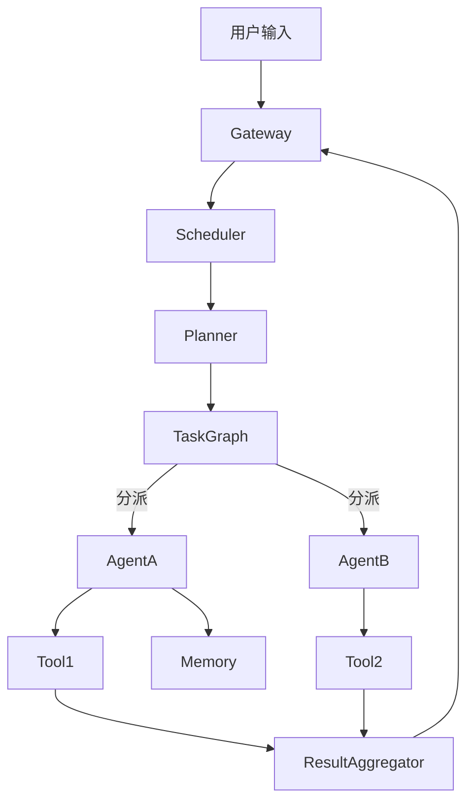

# Agent系统架构演进：从当前到未来的技术路线图

这关乎 Agent 系统的进化路线 —— 从当前的"增强型 prompt 框架"向真正具备任务执行、长期记忆、自我进化能力的"智能体"过渡。以下是从当前 → 工业级 → 未来架构的思考脉络。

---

## 1. 当前主流 Agent 技术架构

当前的 Agent 框架，虽然号称"多组件"，但本质依赖的是 **单轮 LLM 响应 + 外部函数调用** 的驱动机制。典型结构如下：

### 🎯 特征
- 强依赖于大语言模型的上下文推理能力
- 多为同步串行执行（调用链条长，效率低）
- 工具调用往往基于字符串模板生成（缺乏类型安全）
- Memory 多为"检索增强"（RAG），不具备行为反思与结构化记忆
- 缺乏统一的 TaskGraph/调度系统

### 🧱 模块分层（简化版）

```
+-------------------------+
|    AgentController      |   <- 接收用户输入，创建单轮或多轮任务
+-------------------------+
|    Planner / LLM Core   |   <- 调用模型生成"调用什么工具"、"调用内容"
+-------------------------+
|     Tool Executor       |   <- 执行函数或插件调用，返回结果
+-------------------------+
|     Memory / Context    |   <- 检索历史信息增强上下文
+-------------------------+
```

**代表框架：** LangChain、AutoGen、OpenAgents

---

## 2. 工业级 Agent 架构

工业级 Agent 需从"上下文驱动"升级为"**结构化任务驱动 + 高可用系统架构**"，核心目标是：

- 多 Agent 分工协作
- 任务调度系统 + 执行器解耦
- 模块持久化（Memory、Profile、Tool等）
- 可中断、恢复、重试的执行链
- 可调度的 Planner → DAG

### 🧩 工业级架构总览图



### 🔧 工业级关键模块说明

| 模块 | 能力要求 |
|------|----------|
| TaskScheduler | DAG 执行、有状态调度、依赖管理、失败恢复 |
| Planner | 支持"粗规划 → 细任务树"，可解释性任务拆解 |
| Multi-Agent Bus | Agent Profile 管理、广播路由、能力匹配 |
| Agent Memory | 长期 + 短期记忆混合管理，支持 TTL、刷盘、回溯 |
| ToolChain | 函数注册、动态插件、调用日志、安全沙箱 |
| Orchestration | Agent 间对话路由与协作管理（例如角色协商机制） |

### 工业级框架代表：
- **OpenAgents**
- **Autogen**
- **CrewAI**（Python生态轻量级调度）
- **MetaGPT**（拟类公司分工）
- **ChatDev / Lagent**（华为诺亚）

---

## 3. 未来 Agent 架构的演化方向（2025+）

未来的 Agent 会从"控制器+工具调用"的范式，进化为具备类人反思、自适应规划和协作自治能力的系统。未来的 Agent = **AI + OS + Network**。

### 🚀 核心趋势

| 演化维度 | 当前 | 未来目标 |
|----------|------|----------|
| 任务表示 | Prompt / Text | 显式结构化 Task Graph |
| 执行方式 | 同步串行 | 并行分布式、异步中断恢复 |
| 记忆机制 | 向量检索 | 多模态结构化 Episodic 记忆 |
| 协作方式 | 预设流程 | 自适应协商与竞争（Game-like） |
| 能力获取 | 人工接插件 | Agent 自主学习微能力 / Tool |
| 推理机制 | LLM 推理 | Hybrid LLM + Symbolic |
| 角色控制 | 静态 Agent | Profile + 角色演化 |
| 感知输入 | 文字为主 | 多模态融合（图像、语音、网页） |
| OS 支撑 | 应用内嵌式 | Agent 操作系统（AgentOS） |

### 🧠 未来 Agent 的系统层级（可类比操作系统）

```
+-------------------------------------------+
| Application Layer: 多 Agent 应用框架        |
+-------------------------------------------+
| AI Kernel Layer: 规划器 / 记忆 / 决策引擎     |
+-------------------------------------------+
| AgentOS Layer: 通信、资源、调度、插件系统    |
+-------------------------------------------+
| Execution Runtime: LLM + Tool + 系统资源访问  |
+-------------------------------------------+
```

---

## 小结

| 阶段 | 核心驱动力 | 特征 |
|------|------------|------|
| 当前 | Prompt 逻辑 | 轻量封装 LLM，弱状态，少协作 |
| 工业级 | DAG + ToolChain | 结构清晰，支持并发调度、Agent 分工合作 |
| 未来 | AgentOS + 自演化 | 长期演化、跨任务学习、自定义角色自治 |

---

## 结语

Agent 系统的演进不仅仅是技术架构的升级，更是人工智能从"工具"向"智能体"转变的重要里程碑。从当前的 prompt 驱动到未来的自主演化，每一步都代表着 AI 能力的质的飞跃。

在这个快速发展的领域，我们需要既保持对技术趋势的敏锐洞察，也要脚踏实地地构建可落地的工业级解决方案。未来的 Agent 将不仅仅是执行任务的工具，而是能够与人类协作、学习和进化的智能伙伴。

---

*本文探讨了 Agent 系统从当前到未来的技术演进路线。如果你对某个特定阶段的技术细节感兴趣，或者想要深入探讨某个模块的实现方案，欢迎在评论区交流讨论！*